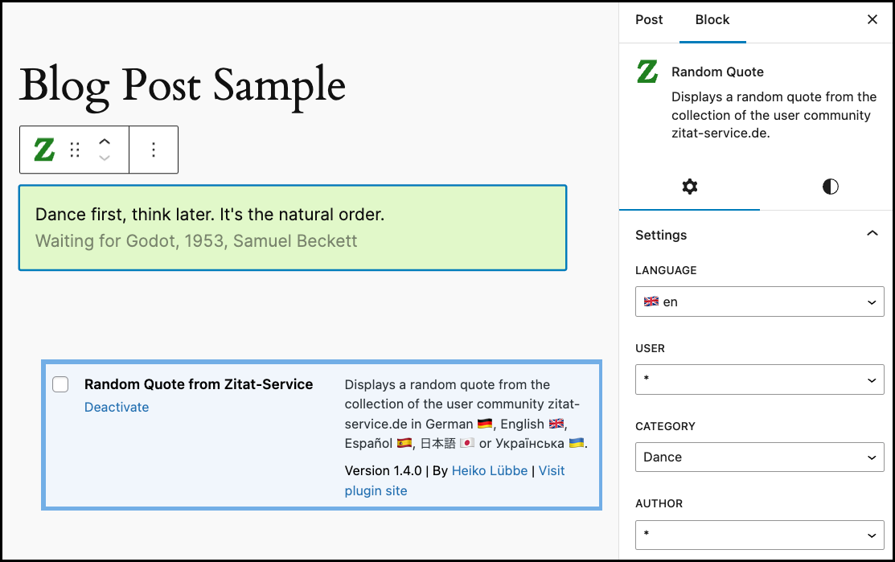

# WordPress Plugin 'Random Quote from Zitat-Service'



Free and open-source WordPress plugin to display random quotes from community [zitat-service.de](https://www.zitat-service.de).

:bulb: **Tip:** There is a WordPress demo installation with plugin *Random Quote from Zitat-Service*
running online at [wp-demo.zitat-service.de](https://wp-demo.zitat-service.de).

:bulb: **Tip:** Help for the WordPress plugin installation and administration is available at [github.com/muhme/quote_wordpress/wiki](https://github.com/muhme/quote_wordpress/wiki).

The public URL for the plugin in the WordPress Plugin Directory is [wordpress.org/plugins/random-quote-zitat-service](https://wordpress.org/plugins/random-quote-zitat-service/).

Change log is available as [CHANGELOG.md](CHANGELOG.md).

## Requirements

* WordPress >= 6.1
* PHP >= 7.4


## Test & Development Environment

Tested are the versions:
  * PHP 7.4 & WordPress 6.1
  * PHP 8.2 & WordPress 6.5

<details>
  <summary>There is a docker test and development environment prepared.</summary>
[Docker](https://www.docker.com/), [git](https://git-scm.com/) and [npm](https://www.npmjs.com/) must be installed. To create your test and development environment run:

```
host$ git clone https://github.com/muhme/quote_wordpress
host$ cd quote_wordpress
host$ docker compose up -d
```

Six Docker containers are running:

```
host$ docker ps
IMAGE                          PORTS                                            NAMES
quote_wordpress-wordpress      0.0.0.0:4080->80/tcp                             quote_wp_wordpress
wordpress:6.1-php7.4-apache    0.0.0.0:4084->80/tcp                             quote_wp_min
phpmyadmin/phpmyadmin          0.0.0.0:4081->80/tcp                             quote_wp_phpmyadmin
mariadb                        3306/tcp                                         quote_wp_mariadb
maildev/maildev                0.0.0.0:1025->1025/tcp, 0.0.0.0:4082->1080/tcp   quote_wp_maildev
mcr.microsoft.com/playwright   0.0.0.0:4083->80/tcp                             quote_wp_playwright
```

Docker containers are:
  * quote_wp_wordpress – WordPress latest version
    * http://host.docker.internal:4080 – WordPress instance, ready for installation, test and development
    * after `scripts/install.sh` the five admin users `admin`, `admin_de`, `admin_es`, `admin_ja` and `admin_uk` exist with the respective locales, password is always `admin`
    * [msmtp](https://marlam.de/msmtp/) is used as a simple SMPT client
    * A small WordPress plugin sets the sender email address (from field) fixed to 'webmaster@docker.local' and fixes the problem of undeliverable address 'wordpress@localhost' inside Docker container. Installing it as [must-use WordPress plugin](https://wordpress.org/support/article/must-use-plugins) to have it already actived.
    * has gettext package, vim and ping installed
  * quote_wp_min - minimum required PHP/WordPress version
    * http://host.docker.internal:4084 – WordPress instance, ready for installation and test
    * after `scripts/install.sh` the five admin users `admin`, `admin_de`, `admin_es`, `admin_ja` and `admin_uk` exist with the respective locales, password is always `admin`
  * quote_wp_mariadb – MariaDB database
    * database available as mariadb:3306
    * user 'root', password 'root' and databases 'wordpress' and 'wp_min'
  * quote_wp_phpmyadmin – phpmyadmin for database administration
    * http://localhost:4081 – phpMyAdmin to work with the database
  * quote_wp_maildev - [MailDev](https://github.com/maildev/maildev) for collecting and showing WordPress mails
    * listening for mails on maildev:1025
    * http://localhost:4082 – MailDev web interface
  * quote_wp_playwright- for E2E testing

:warning: **Caution:** Do not uninstall the plugin in WordPress, otherwise you will also delete source files,
as they are mounted via Docker Volume.

:bulb: **Tip:** To have WordPress working with HTTP and from localhost and inside Docker container, plus access WordPress from Playwrigth container the little trick is to use the URL `http://host.docker.internal:4080`. The hostname `host.docker.internal` is identical inside docker container and on host machine, if you make the following `/etc/hosts` entry:
```bash
127.0.0.1	host.docker.internal
```

### Installation

The command-line interface for WordPress [WP-CLI](https://wp-cli.org/) is used for the script-based completion of the installation and other tasks. After creating the Docker containers `quote_wp_wordpress` and `quote_wp_min` run `scripts/install.sh` once:
```
host$ scripts/install.sh

*** Waiting for container quote_wp_wordpress
waiting for 1 resources: http://host.docker.internal:4080
*** Installing WP-CLI
*** Complete WordPress installation
Success: WordPress installed successfully.
*** Install additional languages
Language 'de_DE' installed.
Language 'es_ES' installed.
Language 'ja' installed.
Language 'uk' installed.
*** Create four additional admins with locales
*** Activate plugin random-quote-zitat-service
*** Recursivly chown to www-data

*** Waiting for container quote_wp_min
waiting for 1 resources: http://host.docker.internal:4084
*** Installing WP-CLI
*** Complete WordPress installation
Success: WordPress installed successfully.
*** Install additional languages
Language 'de_DE' installed.
Language 'es_ES' installed.
Language 'ja' installed.
Language 'uk' installed.
*** Create four additional admins with locales
*** Activate plugin random-quote-zitat-service
*** Recursivly chown to www-data
```

WordPress is installed with the five languages supported by the plugin. The plugin `Random Quote from Zitat-Service` is installed and activated. There are five admin users, each of whom has set one of the languages. Users are `admin`, `admin_de`, `admin_es`, `admin_ja` and `admin_uk`. Password is always `admin`.

### Testing

Automated Playwright tests are in subfolder [test](./test/) and and are described there.

### Scripts

Some bash-scripts are prepared for a pleasant and also faster development, see folder [scripts](./scripts/) and commented list of scripts there.

### Task list for new plugin version
* update version number etc. in
  * package.json
  * readme.txt
  * CHANGELOG.md
  * random-quote-zitat-service.php
  * src/block.json
  * src/helper.php
  * src/common.js
  * languages/\*.po\*
* `scripts/pack.sh full` which is doing:
  * docker exec -it quote_wp_wordpress /var/www/html/wp-content/plugins/random-quote-zitat-service/scripts/i18n-create.sh
  * ncu -> ncu -u && npm install
  * npm audit -> npm audit -fix
  * npm run lint:css
  * npm run lint:js -> npm run lint:js:fix
  * npm run format
  * npm run build
  * scripts/compose.sh build
  * scripts/install.sh
  * scripts/test.sh --workers=2
  * scripts/pack.sh
* manual install the zipped plugin in empty WP, do Plugin Check (PCP) with all categories, do a short test
* git status / git diff / git commit -a / git push

:bulb: **Tip:** If a command fails in `scripts/pack.sh full` this script stops.
If a common fix action is available it is shown after `->`.

</details>

## Usage of External API.zitat-service.de

The WordPress plugin fetches all data from <a href="https://api.zitat-service.de">api.zitat-service.de</a>.
Terms of use and privacy statement can be found in the <a href="https://www.zitat-service.de/en/start/contact">Imprint</a>.

The random quotes on the frontend of the WordPress website are fetched by PHP code that runs on the WordPress server.
This means that the process of retrieving quotes does not involve tracking or recording any user-specific data.
Instead, it operates within the server environment, ensuring user privacy and compliance with guidelines that
prohibit tracking users without their consent.

The displayed quotes, along with their respective authors and sources, are linked externally to websites
such as zitat-service.de and Wikipedia to provide users with additional context and information.
It's important to note that all external links are activated only after manual verification by the admin team
at zitat-service.de, ensuring the reliability and accuracy of the linked content.

## License

GPLv3 License, Copyright (c) 2023 - 2024 Heiko Lübbe, see [LICENSE.txt](LICENSE.txt)

## Contact
Don't hesitate to ask if you have any questions or comments.
