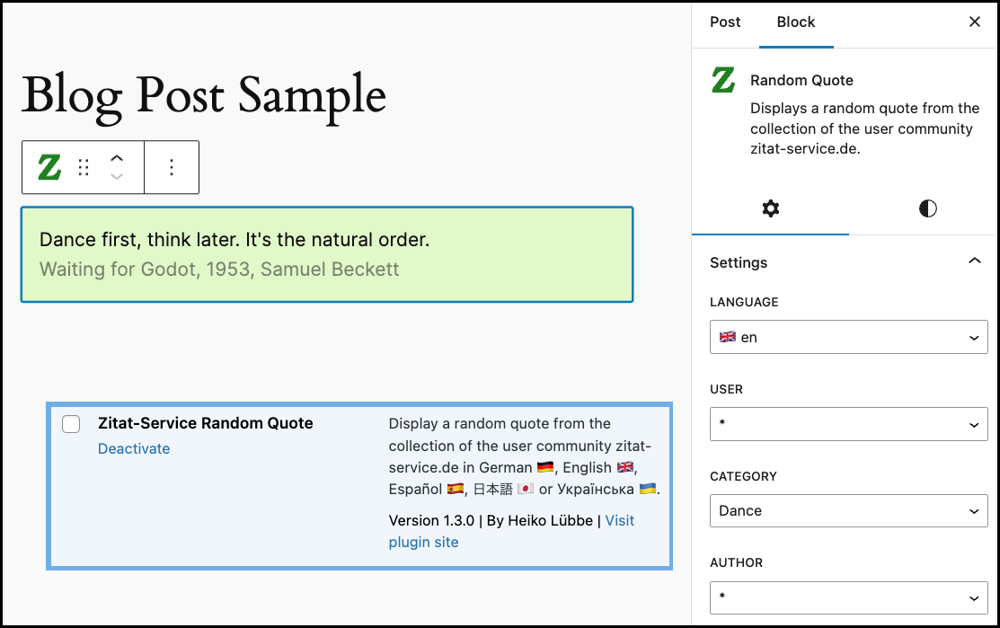

# WordPress Plugin zitat-service.de



WordPress plugin to display random quotes from community [zitat-service.de](https://www.zitat-service.de).

:bulb: **Tip:** Help for the WordPress plugin installation and administration is available at https://github.com/muhme/quote_wordpress/wiki.

## Test & Development Environment
<details>
  <summary>There is a docker test and development environment prepared.</summary>
To create the test and development environment run:

```bash
host$ git clone https://github.com/muhme/quote_wordpress
host$ cd quote_wordpress
host$ docker compose up -d
```

Five Docker containers are running:

```bash
host$ docker ps
IMAGE                          PORTS                                            NAMES
quote_wordpress-wordpress      0.0.0.0:4080->80/tcp                             quote_wp_wordpress
phpmyadmin/phpmyadmin          0.0.0.0:4081->80/tcp                             quote_wp_phpmyadmin
mariadb                        3306/tcp                                         quote_wp_mariadb
maildev/maildev                0.0.0.0:1025->1025/tcp, 0.0.0.0:4082->1080/tcp   quote_wp_maildev
mcr.microsoft.com/playwright   0.0.0.0:4083->80/tcp                             quote_wp_playwright
```

Docker containers are:
  * quote_wp_wordpress – WordPress CMS
    * http://host.docker.internal/:4080 – WordPress instance, ready for installation
    * [msmtp](https://marlam.de/msmtp/) is used as a simple SMPT client
    * A small WordPress plugin sets the sender email address (from field) fixed to 'webmaster@docker.local' and fixes the problem of undeliverable address 'wordpress@localhost' inside Docker container. Installing it as [must-use WordPress plugin](https://wordpress.org/support/article/must-use-plugins) to have it already actived.
  * quote_wp_mariadb – MariaDB database
    * database available as mariadb:3306
    * user 'root', password 'root' and database 'wordpress'
  * quote_wp_phpmyadmin – phpmyadmin for database administration
    * http://localhost:4081 – phpMyAdmin to work with the database
  * quote_wp_maildev - [MailDev](https://github.com/maildev/maildev) for collecting and showing mails
    * listening for mails on maildev:1025
    * http://localhost:4082 – MailDev web interface
  * quote_wp_playwright- for E2E testing

### Installation

For installation completion and other tasks the command-line interface for WordPress [WP-CLI](https://wp-cli.org/). `WP-CLI` is installed and used in docker container `quote_wp_wordpress`. After creating the `quote_wp_wordpress` docker container run `scripts/install.sh` once:
```
host$ scripts/install.sh
*** installing WP-CLI
*** complete WordPress installation
Success: WordPress installed successfully.
*** install additional languages
Language 'de_DE' installed.
Language 'es_ES' installed.
Language 'ja' installed.
Language 'uk' installed.
*** install plugin zitat-service
*** activate plugin zitat-service
Plugin 'zitat-service' activated.
*** recursivly chown to www-data
```

WordPress is installed with the five languages supported by the plugin. The plugin `zitat-service` is installed and activated.

### Testing

Automated Playwright tests are in subfolder [tests](./tests/) and and are described there.

### Scripts

More are scripts prepared for a more pleasant and also faster development, see folder [scripts](./scripts/) and commented list of scripts there.

</details>

## License

MIT License, Copyright (c) 2023 Heiko Lübbe, see [LICENSE](LICENSE)

## Contact
Don't hesitate to ask if you have any questions or comments.
